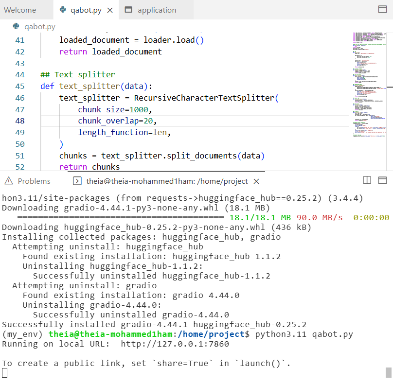
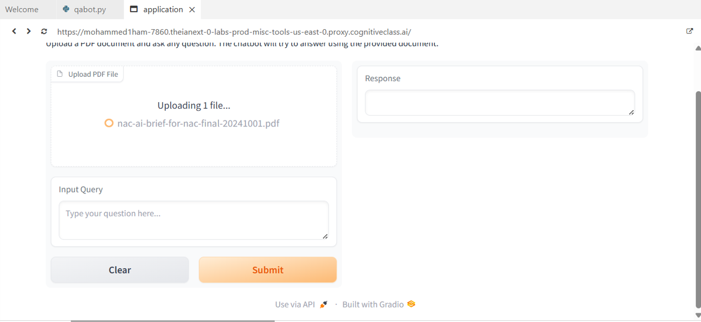
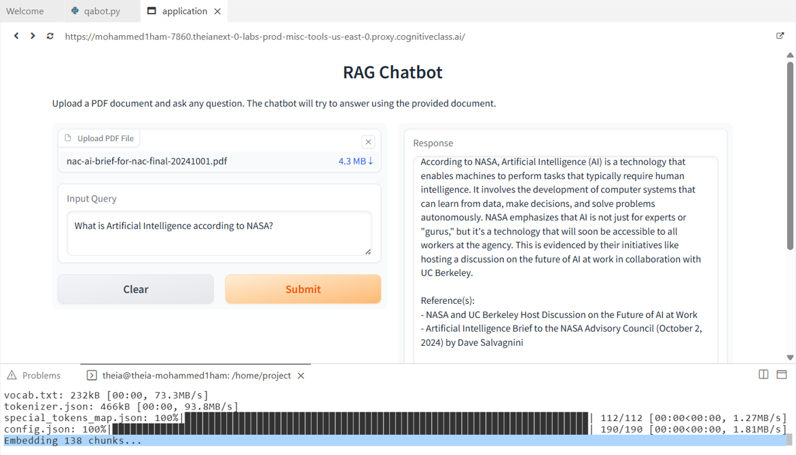
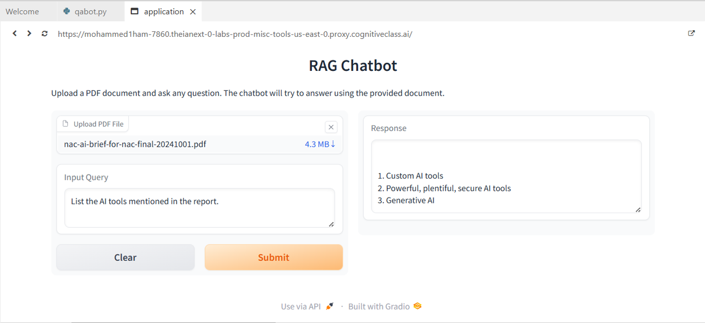
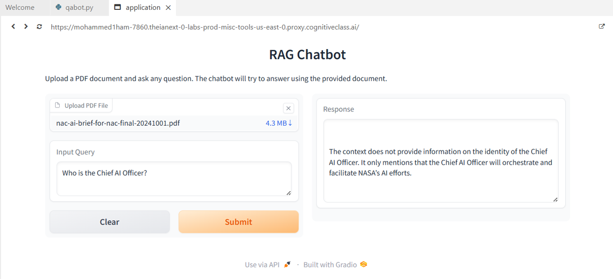
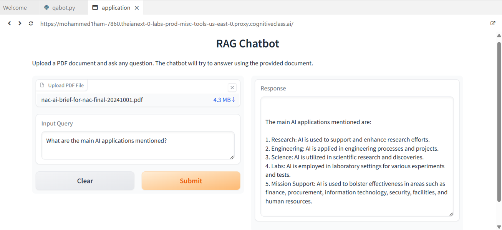

# 📄 RAG PDF Chatbot using WatsonX + HuggingFace + LangChain

This is an interactive **RAG (Retrieval Augmented Generation)** chatbot that allows users to upload a PDF and ask questions about its content.  
It uses **WatsonX LLM** for generating responses and **HuggingFace sentence-transformers** for embeddings.  
A simple **Gradio web UI** is provided for chatting.

---

## 🚀 Features
- Upload any PDF file
- Automatically extracts, chunks, and embeds content
- Answers strictly based on the uploaded document (no outside hallucination)
- Lightweight embeddings using HuggingFace
- Clean Gradio UI

---

## 📂 Project Structure
```
ag-pdf-chatbot/
│
├─ qabot.py
├─ requirements.txt
├─ README.md
├─ .gitignore
│
└─ assets/
    └─ screenshots/
        ├─ 01_start_server_and_url.png
        ├─ 02_upload_pdf.png
        ├─ 03_query_response_01.png
        ├─ 04_query_response_02.png
        ├─ 05_query_response_03.png
        ├─ 06_query_response_04.png

```

---

## 🔧 Installation

Install dependencies manually:
```bash
pip install langchain
pip install langchain-community
pip install langchain_ibm
pip install sentence-transformers
pip install chromadb
pip install pypdf
pip install gradio
```

Or install everything at once:
```bash
pip install -r requirements.txt
```

---

## 🔐 WatsonX Credentials

Inside `qabot.py`, set the following:
```python
WATSONX_API_KEY = "YOUR_API_KEY_HERE"
WATSONX_URL = "https://us-south.ml.cloud.ibm.com"
WATSONX_PROJECT_ID = "YOUR_PROJECT_ID_HERE"
```

---

## ▶️ Running the Application

```bash
python qabot.py
```

Then open your browser and go to:
```
http://127.0.0.1:7860
```

---

## 📝 Notes
- HuggingFace embeddings are used so **no Watson embedding model is required**.
- The code includes a **commented watsonx_embedding() function** if you want to switch later.
- This project is for **learning/demo purposes** — do NOT upload real API keys to GitHub.

---

## ⭐ If you like this project
Give the repo a **star** and feel free to fork & build on it!

---

## 📷 Screenshots

### 🔹 1. Server running & Gradio URL generated


### 🔹 2. PDF uploaded successfully


### 🔹 3. First query and response


### 🔹 4. Second query and response


### 🔹 5. Third query and response


### 🔹 6. Fourth query and response

